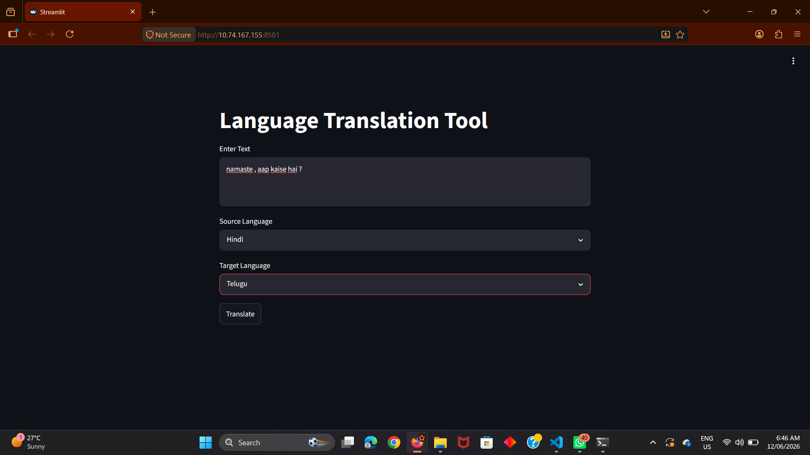

🌍 AI Language Translation Tool

Overview

The AI Language Translation Tool is a web application developed using Python and Streamlit that translates text from one language to another. It uses the Google Translator service through the Deep Translator library to provide fast and accurate translations.

Features

- Translate text between multiple languages
- Simple and user-friendly interface
- Real-time translation
- Supports languages such as English, Telugu, Hindi, Tamil, French, and German
- Built using Python and Streamlit

Technologies Used

- Python
- Streamlit
- Deep Translator

Project Structure

Language_Translation_Tool/
│
├── app.py
├── requirements.txt
└── README.md

Installation

1. Clone or download the project.

2. Install the required libraries:

pip install -r requirements.txt

Running the Application

Run the following command:

streamlit run app.py

When Streamlit starts, it may optionally ask for an email address. You can skip this step.

After launching, Streamlit displays a Local URL and a Network URL. Open either URL in your browser to access the application.

How to Use

1. Enter the text you want to translate.
2. Select the source language.
3. Select the target language.
4. Click the Translate button.
5. View the translated output instantly.

Example

Input:

Hello, how are you?

Source Language: English

Target Language: Telugu

Output:

హలో, మీరు ఎలా ఉన్నారు?

Future Enhancements

- Add support for more languages
- Speech-to-text translation
- Text-to-speech functionality
- Translation history
- Copy translated text option

Author

Kavya Muthukula

Conclusion

This project demonstrates the practical use of Natural Language Processing (NLP) and language translation technologies through a simple and interactive web application developed using Python and Streamlit.

## Screenshots

### Home Page

### Text Input

### Translation Output

