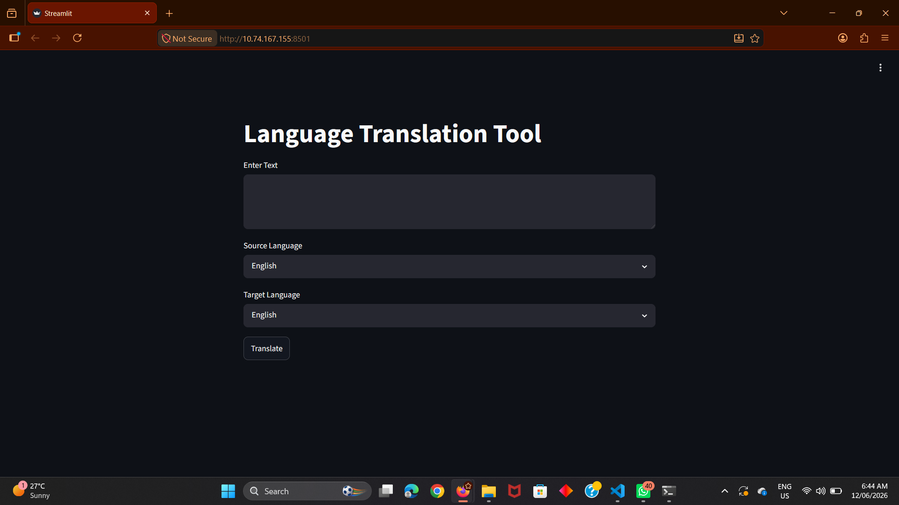
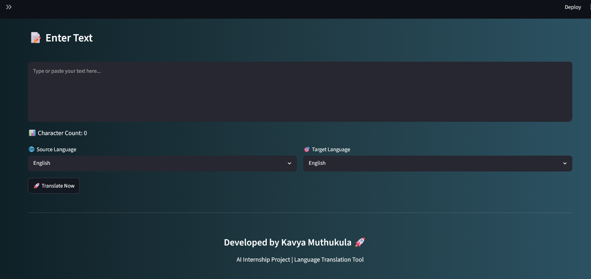
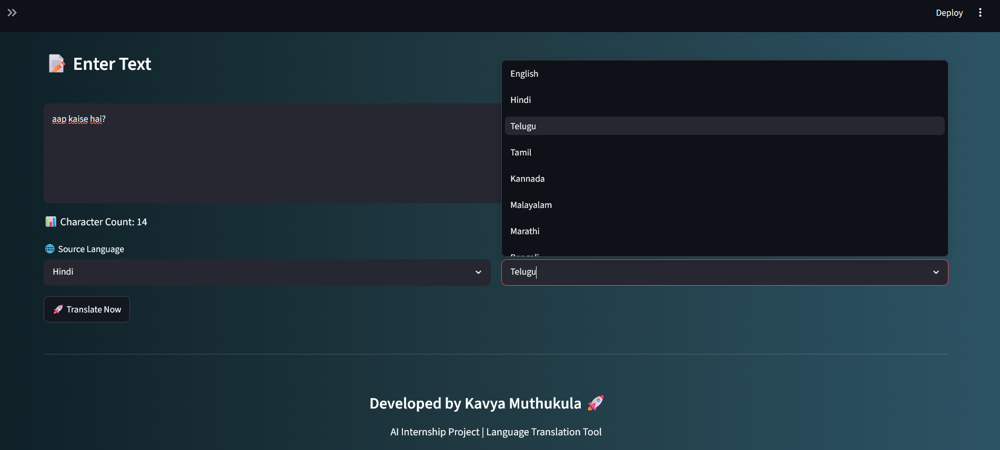
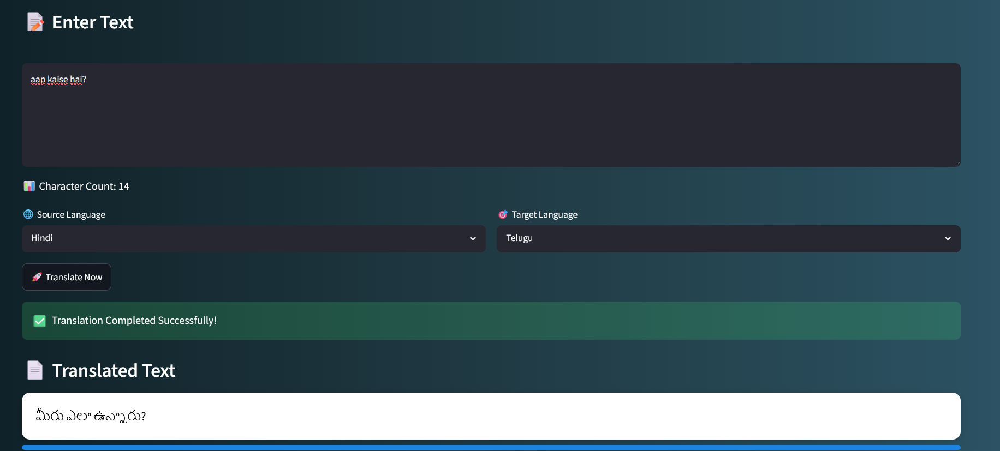
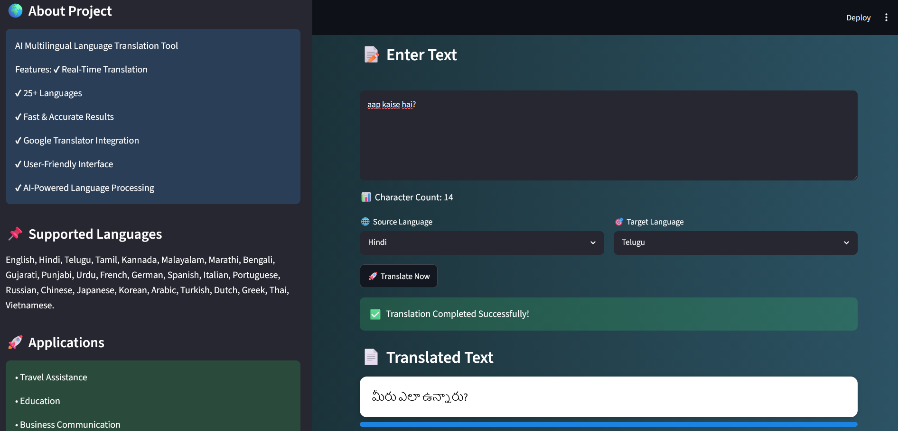

# 🌍 AI Multilingual Language Translation Tool

## 🌟 Overview

AI Multilingual Language Translation Tool is an intelligent web application developed using Python, Streamlit, and Google Translator API. The application enables users to translate text instantly between multiple Indian and international languages through a simple and interactive interface.

This project demonstrates the practical application of Natural Language Processing (NLP) and language translation technologies to facilitate seamless communication across different languages.

---

## 🎯 Project Objectives

* Develop an AI-powered language translation application.
* Enable real-time translation between multiple languages.
* Provide an intuitive and user-friendly interface.
* Demonstrate the integration of language processing APIs in web applications.
* Promote multilingual communication and accessibility.

---

## ✨ Key Features

✅ Real-Time Language Translation

✅ Support for 25+ Languages

✅ Interactive Streamlit Dashboard

✅ Fast and Accurate Translation

✅ Google Translator Integration

✅ User-Friendly Interface

✅ Character Count Tracking

✅ Professional Dashboard Design

✅ Multilingual Communication Support

---

## 🛠️ Technologies Used

| Technology            | Purpose                     |
| --------------------- | --------------------------- |
| Python                | Core Programming Language   |
| Streamlit             | Web Application Development |
| Deep Translator       | Language Translation        |
| Google Translator API | Translation Engine          |
| NLP Concepts          | Language Processing         |

---

## 🌐 Supported Languages

* English
* Hindi
* Telugu
* Tamil
* Kannada
* Malayalam
* Marathi
* Bengali
* Gujarati
* Punjabi
* Urdu
* French
* German
* Spanish
* Italian
* Portuguese
* Russian
* Chinese
* Japanese
* Korean
* Arabic
* Turkish
* Dutch
* Greek
* Thai
* Vietnamese

---

## 🏗️ Project Workflow

```text
User Input Text
        │
        ▼
Select Source Language
        │
        ▼
Select Target Language
        │
        ▼
Google Translation Engine
        │
        ▼
Translated Output
```

---

## 📂 Project Structure

```text
AI_Multilingual_Language_Translation_Tool/
│
├── app.py
├── requirements.txt
├── README.md
├── home_page.png
├── text_input.png
├── language_selection.png
├── translation_result.png
└── project_dashboard.png
```

---

## 🚀 Installation & Setup

### Install Dependencies

```bash
pip install -r requirements.txt
```

### Run the Application

```bash
streamlit run app.py
```

### Open in Browser

```text
http://localhost:8501
```

---

## 💡 Use Cases

* Travel Assistance
* Language Learning
* Educational Applications
* International Communication
* Business Communication
* Content Translation
* Cross-Language Collaboration

---

## 📸 Screenshots

### 🏠 Home Page



### ⌨️ Text Input



### 🌐 Language Selection



### 🔄 Translation Result



### 📊 Project Dashboard



---

## 📈 Applications

* Educational Institutions
* Multilingual Content Creation
* International Businesses
* Customer Support Systems
* Travel and Tourism
* Language Research

---

## 🎓 Learning Outcomes

Through this project, the following concepts were explored:

* Natural Language Processing Fundamentals
* Language Translation Technologies
* API Integration
* Streamlit Web Development
* User Interface Design
* Real-Time Data Processing
* Software Development Best Practices

---

## 🔮 Future Enhancements

* Voice-to-Text Translation
* Text-to-Speech Translation
* Document Translation Support
* Translation History Storage
* Language Detection Feature
* Cloud Deployment
* AI-Based Context-Aware Translation

---

## 👩‍💻 Developer

**Kavya Muthukula**

Artificial Intelligence & Machine Learning Enthusiast

---

## 📌 Conclusion

The AI Multilingual Language Translation Tool demonstrates how Artificial Intelligence and Natural Language Processing technologies can be leveraged to break language barriers and improve communication. By integrating real-time translation capabilities with an interactive user interface, the project provides a practical solution for multilingual communication and learning.
